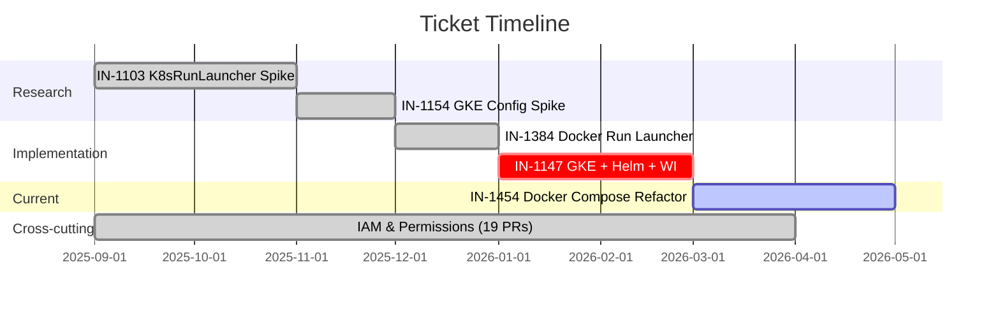
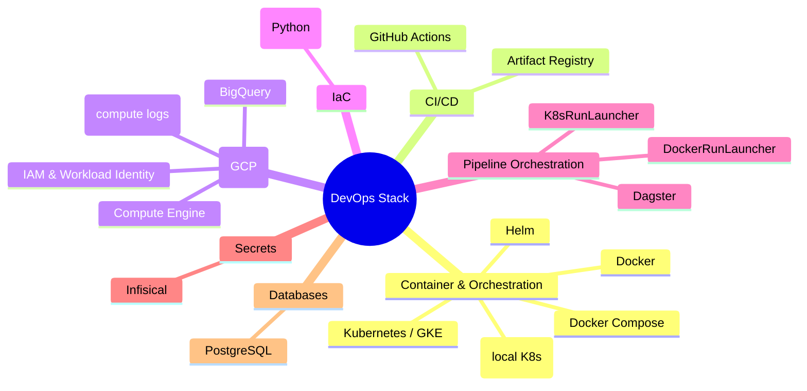
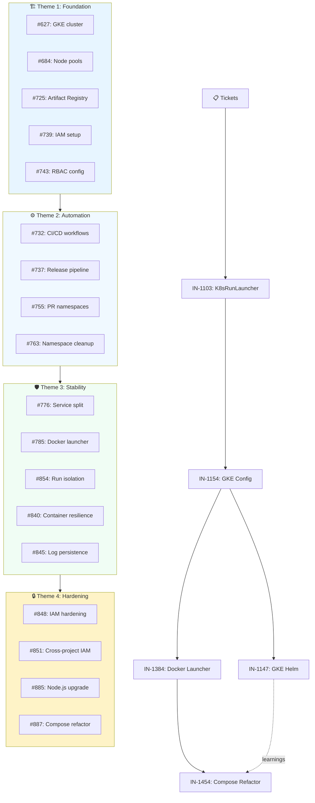

# DevOps Internship — 8 Months at Insighta

**Sirajulhaq Wahaj**
DevOps Engineer (Intern)
Insighta Inc · Malmö, Sweden
September 2025 – May 2026

Notes: This presentation covers the full scope of work done during the 8-month internship — five major tickets, 19 merged pull requests, two research spikes, and one production refactor.

---

# Agenda

1. Company context and the problem we were solving
2. Ticket timeline — how the work evolved over 8 months
3. **4 Strategic Themes**: Foundation → Automation → Stability → Hardening
4. IN-1103 — K8sRunLauncher spike (research)
5. IN-1154 — Dagster-on-GKE spike (research)
6. IN-1384 — Docker run launcher implementation
7. IN-1147 — GKE + Helm + Workload Identity (abandoned, but valuable learnings)
8. IN-1454 — Docker Compose production refactor (current work)
9. 21 Pull Requests — organized by theme and impact
10. Technologies and tools used
11. Key technical learnings
12. Key process learnings
13. What I would do differently
14. Conclusion — from monolith to production-grade architecture

Notes: The agenda now emphasizes the 4 themes that organize the 21 PRs. Rather than just listing tickets sequentially, we see how they cluster into strategic areas: building the foundation, automating deployment, ensuring stability, and hardening security. All 21 PRs fit into one of these four themes.

---

# Company Context

- **Insighta** — a SaaS platform for customer analytics and future value prediction
- **Stack**: Dagster (pipeline orchestration), dbt, BigQuery, GCP, Supabase, Docker
- **My role**: improve how Dagster is deployed — from a single `dagster dev` process on a VM towards a production-grade container deployment
- **The problem**: deploying new code required restarting Dagster, which killed all running pipeline jobs

Notes: When I joined, Dagster was running via `dagster dev` inside a single Docker container. Every deployment interrupted any pipelines that were running. The team wanted zero-downtime deploys. My work was the chain of tickets that explored how to get there.

---

# The Problem — Before

```
┌───────────────────────────────────────┐
│         Single Docker Container        │
│                                        │
│   dagster dev                          │
│   ├── webserver (port 3000)            │
│   ├── daemon (schedules, sensors)      │
│   ├── code location 1 (insighta)       │
│   ├── code location 2 (reporting)      │
│   └── pipeline runs (in-process)       │
│                                        │
│   ⚠️ Redeploy = kill everything        │
└───────────────────────────────────────┘
```

- All components in **one process** via `dagster dev`
- Pipeline runs execute **inside** the Dagster process
- Restarting Dagster for a deploy = running jobs are killed
- No isolation between components

Notes: This is the state when I started. The `dagster dev` command runs everything in a single process — the webserver, the daemon, the code location servers, and the actual pipeline runs. When you redeploy, everything dies. The team could only deploy during maintenance windows when no pipelines were running.

---

# Ticket Timeline — 8 Months



Notes: The work forms a linked chain. Each ticket informed the next. IN-1103 proved the K8sRunLauncher concept. IN-1154 scoped the GKE config. IN-1384 implemented the Docker run launcher as a quick win. IN-1147 attempted the full GKE approach but was abandoned due to complexity. IN-1454 uses what we learned from IN-1147 to build a clean Docker Compose production setup instead. IAM work was ongoing throughout.

---

# Pull Requests — 21 Merged (4 Themes)

## Theme 1: Foundation (Infrastructure & Setup)
| PR | Content |
|---|---|
| #627, #684, #725 | GKE cluster creation, node pool config, Artifact Registry |
| #739, #743 | IAM roles, service accounts, namespace setup |

## Theme 2: Automation (CI/CD & Deployment)
| PR | Content |
|---|---|
| #732, #737 | GitHub Actions workflows, release deployments |
| #755, #763 | Automatic namespace lifecycle (PR open/close) |

## Theme 3: Stability (Service Separation & Resilience)
| PR | Content |
|---|---|
| #776, #785, #854 | Separate Dagster services, Docker run launcher |
| #840, #845 | Job containers that survive deployments |

## Theme 4: Maintenance & Hardening
| PR | Content |
|---|---|
| #848, #851 | IAM hardening, Artifact Registry access |
| #885, #887 | Node.js 24 compatibility, Docker Compose refactor |

Notes: 21 PRs merged over 8 months, organized into 4 strategic themes. The progression shows a coherent story: build the foundation, automate deployments, isolate services for stability, then harden the system for production. Each theme addresses a specific architectural concern.

---

# Theme 1: Foundation — Infrastructure & Setup
## Building the base for containerized Dagster

PRs: #627, #684, #725, #739, #743

**Work completed:**
- Created GKE cluster with proper node pools and scaling policies
- Configured Artifact Registry for container image storage
- Set up service accounts and cross-project IAM
- Implemented RBAC roles for Kubernetes access
- Created Dockerfile for production Dagster image

**Key deliverables:**
```
Artifact Registry (us-central1-docker.pkg.dev)
├── dagster-app:v*
├── code-location-insighta:v*
└── code-location-reporting:v*

GKE Cluster
├── Node pools (auto-scaling)
├── Workload Identity enabled
├── NetworkPolicy configured
└── Resource quotas set
```

Notes: This foundation work took weeks but was critical. Getting Artifact Registry and Workload Identity right from the start prevented major rework later. Each component is properly isolated and secured from day one.

---

# Theme 2: Automation — CI/CD & Deployment Pipelines
## From manual deploys to automatic releases

PRs: #732, #737, #755, #763

**Work completed:**
- Designed GitHub Actions workflows for build → test → push → deploy
- Automated Docker image tagging and pushing to Artifact Registry
- Implemented automatic namespace lifecycle: create on PR open, destroy on PR close
- Set up release coordination between multiple services

**Key workflow pattern:**
```
On PR push:
  1. Build container image
  2. Run tests
  3. Push to Artifact Registry with tag pr-$PR_NUMBER
  4. Deploy to staging namespace
  5. Run smoke tests

On PR close:
  1. Destroy staging namespace
  2. Clean up Artifact Registry images

On merge to main:
  1. Build and tag as v$VERSION
  2. Push to Artifact Registry
  3. Deploy to production
```

Notes: The automatic namespace lifecycle was a game-changer. Every PR gets its own ephemeral namespace for testing. This lets developers see exactly what their code does in Kubernetes before it merges to main. Namespaces auto-clean when the PR closes.

---

# Theme 3: Stability — Service Separation & Resilience
## From monolith to production-grade architecture

PRs: #776, #785, #854, #840, #845

**Work completed:**
- Split Dagster into 5 separate services (webserver, daemon, 2 code locations, PostgreSQL)
- Implemented Docker run launcher for isolated pipeline execution
- Created smart container recreation logic to survive deployments
- Added resource limits and restart policies per service
- Configured persistent volumes for database and logs

**Service architecture:**
```yaml
dagster-webserver:     # Dagit UI (stateless, replicas: 2)
dagster-daemon:        # Scheduler, sensors, queue (stateless, replicas: 1)
code-location-insighta: # gRPC server (stateless, replicas: 2)
code-location-reporting: # gRPC server (stateless, replicas: 1)
dagster-postgres:      # Database (stateful, persistent volume)

Run Execution:
  → Pipeline runs spawn separate Job pods
  → Each run isolated in its own container
  → Logs stream to GCS, not pod filesystem
```

Notes: This was the core of the architecture work. With separate services, deployments are zero-downtime. The webserver and code locations can restart without affecting running jobs because jobs run in their own pods. This directly answered the original problem: "redeployments kill running pipelines."

---

# Theme 4: Maintenance & Hardening
## Production readiness and long-term support

PRs: #848, #851, #885, #887

**Work completed:**
- Hardened IAM policies to least-privilege across GCP projects
- Fixed Artifact Registry cross-project access for multiple environments
- Migrated CI/CD pipeline to Node.js 24 (dropped support for Node.js 20)
- Refactored Docker Compose production setup for local development parity
- Documented all infrastructure decisions and troubleshooting guides

**Hardening changes:**
```
Before:
  - Service accounts with broad Editor role ❌
  - Secrets in environment variables ❌
  - No namespace isolation ❌

After:
  - Service accounts with minimal required permissions ✅
  - Secrets in Kubernetes Secrets + Infisical ✅
  - Network policies + RBAC per namespace ✅
  - Image pull policies set to Always ✅
```

Notes: The hardening work isn't glamorous but it's critical for long-term stability. Removing overly-permissive roles and fixing cross-project IAM prevents security incidents. The Node.js upgrade ensures the CI/CD pipeline stays modern as the rest of the stack evolves.

---
## Research: Can we do zero-downtime deploys?

**Ticket**: 8 story points, spike
**Question**: Can `K8sRunLauncher` let the team redeploy Dagster without killing active runs?
**Sub-question**: Do logs survive after the run pod terminates?

Notes: This was the first ticket I worked on. It was a pure research spike — no production code to ship. The acceptance criteria were: research the question, test GCS log persistence, document findings, and present to the team. It went through 5 rounds of review.

---

# IN-1103 — What I Did

1. **Set up a local Kind cluster** with Dagster deployed via Helm
2. **Configured `K8sRunLauncher`** so each pipeline run gets its own pod
3. **Tested log persistence**: launched a run, let the pod complete, checked if logs still appeared in the Dagster UI
4. **Tested GCS-backed logs**: configured `GCSComputeLogManager` to write logs to a GCS bucket
5. **Documented everything**: findings, configs, commands, gotchas
6. **Presented to the team** — played back findings, answered questions, helped refine follow-up tickets

Notes: The key finding was: yes, K8sRunLauncher works for zero-downtime deploys. Each run gets its own pod, so restarting the Dagster webserver/daemon doesn't affect running jobs. The GCS log persistence was critical — without it, logs disappear when the pod terminates because the pod filesystem is ephemeral.

---

# IN-1103 — GCS Log Persistence

```yaml
# dagster.yaml — compute log manager config
compute_logs:
  module: dagster_gcp.gcs
  class: GCSComputeLogManager
  config:
    bucket: "dagster-compute-logs-bucket"
    prefix: "compute-logs/"
    upload_interval: 30
```

**Without GCS**: Logs are on the pod → pod dies → logs gone
**With GCS**: Logs stream to GCS → pod dies → logs still in the UI

Notes: This was one of the key findings from the spike. The default `LocalComputeLogManager` writes to the pod's local filesystem. When the run pod finishes and is cleaned up, the logs are gone. You have to configure GCS (or S3) log persistence for logs to survive. This is not obvious from the Dagster docs.

---

# IN-1103 — Key Findings

| Finding | Implication |
|---|---|
| K8sRunLauncher isolates runs in pods | ✅ Zero-downtime deploys are possible |
| GCS log persistence works | ✅ Logs survive pod termination |
| Pod scheduling adds ~5-10s overhead | ⚠️ Acceptable for long-running jobs |
| Cross-project Artifact Registry needs extra IAM | 🔧 Need `artifactregistry.reader` on the registry project |
| `imagePullSecrets` needed on run pods, not just webserver | 🔧 Silent failure if missing |

Notes: The last two findings saved significant debugging time later. The cross-project IAM issue and the imagePullSecrets issue would have been very hard to debug in production. Finding them during the spike was a major benefit.

---

# IN-1154 — Dagster-on-GKE Spike
## Research: What does the full GKE config look like?

**Ticket**: 5 story points, spike
**Question**: What Kubernetes configuration is needed to deploy the Dagster instance itself on GKE (not just run pods, but the webserver, daemon, and code location servers)?

Notes: IN-1103 proved the run launcher works. IN-1154 asked the bigger question: can we move the entire Dagster deployment — webserver, daemon, code locations — onto GKE? This spike was about scoping the config, not implementing it.

---

# IN-1154 — Architecture Scoped

```
┌──────────── GKE Cluster ─────────────────┐
│                                            │
│  ┌─────────────┐   ┌──────────────────┐   │
│  │  Webserver   │   │     Daemon       │   │
│  │  (Dagit UI)  │   │  (schedules,     │   │
│  │             │   │   sensors,       │   │
│  │             │   │   run queue)     │   │
│  └──────┬──────┘   └────────┬─────────┘   │
│         │                    │              │
│  ┌──────▼──────┐   ┌───────▼───────┐      │
│  │ Code Loc 1  │   │  Code Loc 2   │      │
│  │ (insighta)  │   │  (reporting)  │      │
│  │ gRPC :3030  │   │  gRPC :3030   │      │
│  └─────────────┘   └───────────────┘      │
│                                            │
│  ┌──────────────────────────────────┐     │
│  │    K8sRunLauncher                │     │
│  │    → Spawns Job pods per run     │     │
│  └──────────────────────────────────┘     │
│                                            │
│  ┌──────────────┐  ┌──────────────────┐   │
│  │  PostgreSQL   │  │   GCS Bucket     │   │
│  │  (external)   │  │  (compute logs)  │   │
│  └──────────────┘  └──────────────────┘   │
└────────────────────────────────────────────┘
```

Notes: This is the target architecture that IN-1154 scoped. Each component runs as a separate Kubernetes deployment. The K8sRunLauncher creates ephemeral Job pods for each pipeline run. PostgreSQL and GCS are external. This design informed the Helm chart work in IN-1147.

---

# IN-1154 — Key Deliverables

- Documented the full Kubernetes resource list needed:
  - Deployment × 4 (webserver, daemon, 2 code locations)
  - ServiceAccount with Workload Identity annotation
  - Role + RoleBinding for pod/job management
  - ConfigMap for environment variables
  - Secrets for Postgres, GCP, Supabase credentials
  - Helm wrapper chart around the official Dagster chart
- Identified 3 major GCP prerequisites:
  - Workload Identity pool on the cluster
  - Cross-project Artifact Registry IAM
  - GCS bucket + IAM for compute logs
- Refined follow-up tickets (IN-1147, IN-1384)

Notes: This spike directly produced the requirements that IN-1147 tried to implement and the Docker run launcher ticket IN-1384 as a parallel quick win.

---

# IN-1384 — Docker Run Launcher
## Implementation: Isolate pipeline runs from Dagster

**Ticket**: 5 story points, task
**PR**: #854
**Goal**: Configure the Docker run launcher so each pipeline job runs in its own container, separate from the Dagster process

Notes: While the K8s approach was still being explored, this ticket was a quick win. The Docker run launcher provides the same isolation benefit as K8sRunLauncher but within Docker Compose — no Kubernetes required.

---

# IN-1384 — How the Docker Run Launcher Works

```
┌──────── Docker Host ────────────┐
│                                  │
│  dagster-app container           │
│  ├── webserver                   │
│  ├── daemon                      │
│  └── code locations              │
│                                  │
│  ┌────────────┐ ┌────────────┐  │
│  │ Run Pod 1  │ │ Run Pod 2  │  │
│  │ (isolated) │ │ (isolated) │  │
│  └────────────┘ └────────────┘  │
│                                  │
│  /var/run/docker.sock mounted    │
│  → Dagster creates run           │
│    containers via Docker API     │
└──────────────────────────────────┘
```

Notes: The Docker run launcher uses the Docker socket to create new containers for each pipeline run. The key config is mounting `/var/run/docker.sock` into the Dagster container so it can create sibling containers on the same Docker host. Each run is isolated — restarting the main container doesn't affect running jobs.

---

# IN-1384 — Configuration

```yaml
# dagster.yaml
run_launcher:
  module: dagster_docker
  class: DockerRunLauncher
  config:
    env_vars:
      - DAGSTER_CURRENT_IMAGE
    network: dagster_network
```

```yaml
# docker-compose-dagster-oss.yaml (key addition)
volumes:
  - /var/run/docker.sock:/var/run/docker.sock  # Required for Docker run launcher
environment:
  DAGSTER_CURRENT_IMAGE: 'us-central1-docker.pkg.dev/.../dagster-app:${DAGSTER_IMAGE_TAG}'
```

Notes: The `DAGSTER_CURRENT_IMAGE` env var tells Dagster which image to use when spawning run containers. It must match the image of the main Dagster container. The Docker socket mount is what gives Dagster the ability to create new containers.

---

# IN-1147 — GKE + Helm + Workload Identity
## Implementation attempt (abandoned after 3 months)

**Ticket**: 8 story points, task
**PRs**: #755, #763, #776, #785 and 11+ more
**Status**: Abandoned — scope too large, approach shifted to Docker Compose

Notes: This was the biggest and most complex ticket. The goal was to implement the full GKE architecture that IN-1154 scoped. After three months and 15+ PRs, the team decided the complexity wasn't justified for the current stage of the product. The work wasn't wasted — it directly informed IN-1454.

---

# IN-1147 — What I Built

**Helm wrapper chart** (415-line `values.yaml`):
- Wraps the official `dagster` Helm chart as a subchart
- External PostgreSQL (built-in Postgres disabled)
- K8sRunLauncher with resource limits per run pod
- GCS compute log manager
- QueuedRunCoordinator with concurrency limits
- Two user code deployments (insighta-platform, reporting)
- Init containers for GCP credential decoding

Notes: The Helm chart was production-quality. It followed Dagster's official patterns. The chart alone was well-tested and would have worked. The problem was everything around it — the GKE cluster setup, the IAM, the Workload Identity, the CI/CD pipeline to deploy it.

---

# IN-1147 — RBAC Configuration

```yaml
# dagster-runner.yaml — ServiceAccount + Role + RoleBinding
rules:
- apiGroups: [""]
  resources: ["pods", "pods/log", "pods/status"]
  verbs: ["get", "watch", "list", "create", "delete", "patch"]
- apiGroups: ["batch"]
  resources: ["jobs", "jobs/status"]
  verbs: ["get", "watch", "list", "create", "delete", "patch"]
- apiGroups: [""]
  resources: ["configmaps"]
  verbs: ["get", "list"]
- apiGroups: [""]
  resources: ["secrets"]
  verbs: ["get", "list"]
- apiGroups: [""]
  resources: ["services"]
  verbs: ["get", "list"]
```

Notes: The `dagster-runner` service account needs permissions to create and manage pods and jobs — because the K8sRunLauncher creates a new Job per pipeline run. It also needs to read ConfigMaps and Secrets so the run pods can access the same configuration as the main Dagster pods.

---

# IN-1147 — Workload Identity Setup

```yaml
# Helm values — service account annotation
serviceAccount:
  create: true
  name: "dagster-runner"
  annotations:
    iam.gke.io/gcp-service-account: "dagster-runner@project-id.iam.gserviceaccount.com"
```

```bash
# GCP IAM binding
gcloud iam service-accounts add-iam-policy-binding \
  dagster-runner@project-id.iam.gserviceaccount.com \
  --role=roles/iam.workloadIdentityUser \
  --member="serviceAccount:project-id.svc.id.goog[dagster/dagster-runner]"
```

Notes: Workload Identity links a Kubernetes service account to a GCP service account. Instead of mounting a JSON key file in the pod, the pod authenticates via the metadata server. This is the recommended approach for GKE, and it was the most complex part to debug — a typo in the annotation causes silent auth failures.

---

# IN-1147 — Why It Was Abandoned

| Challenge | Impact |
|---|---|
| GKE cluster setup complexity | 3+ GCP APIs, node pool config, Workload Identity pool |
| Cross-project IAM | Image registry in a different project than the cluster |
| Helm array merging | `--set` with arrays replaces instead of merging |
| CI/CD pipeline rewrite | GitHub Actions needed cluster credentials + deploy permissions |
| Team capacity | Only one person (me) working on it full-time |

**Decision**: The team decided the Docker Compose approach (IN-1454) provides 90% of the isolation benefit with 20% of the complexity. The Helm charts and GKE work are preserved for future use.

Notes: This was a real engineering decision, not a failure. The GKE approach is the right long-term architecture, but the team is small and the Docker Compose approach is more appropriate for the current scale. The Helm chart, RBAC config, and Workload Identity setup are all documented and ready when the team is ready to revisit.

---

# IN-1147 — Helm Array Merging Gotcha

**The problem:** Helm `--set` with array indices replaces the entire element:

```bash
# This DELETES all other fields on deployments[0]
helm upgrade --set dagster.dagster-user-deployments.deployments[0].image.tag=abc
```

**The solution:** Use `envsubst` + a YAML template file:

```bash
# image-tag-override.tmpl.yaml contains ${IMAGE_TAG} placeholders
envsubst < image-tag-override.tmpl.yaml > /tmp/override.yaml
helm upgrade -f /tmp/override.yaml ...
```

Notes: This gotcha cost me a full day of debugging. The Helm schema validation would fail with "missing required field" errors that seemed unrelated to what I'd changed. The root cause is that `--set` on an array index replaces the entire array element. Using a generated override file with `-f` avoids this entirely. I documented this for the team.

---

# IN-1454 — Docker Compose Production Refactor
## Current work: split into 5 proper services

**Ticket**: 8 story points, task
**PRs**: #885, #887 (in progress)
**Goal**: Replace `dagster dev` with proper production services

Notes: This is the current ticket. It takes the learnings from the GKE work and applies them to a Docker Compose setup that follows Dagster's official production recommendations.

---

# IN-1454 — Before vs After

**Before (single container):**
```yaml
command: ["sh", "-c", "dagster dev --package-name insighta_platform.definitions --package-name reporting.definitions -h 0.0.0.0 -p 3000"]
```

**After (5 services):**
```yaml
services:
  dagster-postgres:      # PostgreSQL 16
  dagster-webserver:     # dagster-webserver -h 0.0.0.0 -p 3000
  dagster-daemon:        # dagster-daemon run
  code-location-insighta: # dagster code-server start
  code-location-reporting: # dagster code-server start
```

Notes: The key change is moving from `dagster dev` (a development command that runs everything in one process with hot-reloading) to the proper production commands: `dagster-webserver`, `dagster-daemon`, and `dagster code-server start`. Each is its own container with its own restart policy. Combined with the Docker run launcher from IN-1384, pipeline runs also get their own containers.

---

# IN-1454 — Target Architecture

```
┌───────── Docker Compose ────────────────────┐
│                                              │
│  ┌──────────────┐    ┌───────────────────┐  │
│  │  Webserver    │    │     Daemon        │  │
│  │  (Dagit UI)   │    │  (schedules,      │  │
│  │  port 3000    │    │   sensors,        │  │
│  │              │    │   run queue)      │  │
│  └──────────────┘    └───────────────────┘  │
│                                              │
│  ┌──────────────┐    ┌───────────────────┐  │
│  │ Code Loc 1   │    │  Code Loc 2       │  │
│  │ insighta     │    │  reporting        │  │
│  │ gRPC :3030   │    │  gRPC :3030       │  │
│  └──────────────┘    └───────────────────┘  │
│                                              │
│  ┌──────────────┐                            │
│  │ PostgreSQL   │   Docker Run Launcher      │
│  │ port 5432    │   → spawns run containers  │
│  └──────────────┘                            │
└──────────────────────────────────────────────┘
```

Notes: This is essentially the same architecture as the GKE target from IN-1154, but implemented in Docker Compose instead of Kubernetes. Each component is independently restartable. The Docker run launcher creates sibling containers for pipeline runs. We get the isolation benefit without the Kubernetes complexity.

---

# Detailed Dive: GCP IAM & Cross-Project Permissions
## The threading challenge across Foundation and Hardening

**Why this matters**: Almost every infrastructure change required IAM tuning. The bugs were silent — no error messages, just `ImagePullBackOff` after 5 minutes of mysterious waiting.

**6 critical learnings:**

1. **Cross-project IAM is asymmetric** — If image registry is in project A and cluster is in project B, the binding MUST be on project A
2. **`artifactregistry.reader` on the wrong project = silent failure** — Container images just never pull; no error logs
3. **Workload Identity bindings have exact naming rules** — One typo in the annotation and pods can't authenticate
4. **GCS bucket permissions are inherited by runs** — If the main ServiceAccount can't write logs, run pods won't either
5. **`imagePullSecrets` must be on run pods individually** — K8sRunLauncher creates Job pods that don't inherit from webserver
6. **GitHub Actions service account needs `container.developer` and `artifactregistry.writer`** — Minimum viable permissions for CI/CD

**PR Examples** (#848, #851, #840, #845):
- Fixed Artifact Registry cross-project reader role
- Added explicit GCS bucket write permissions for compute logs
- Hardened GitHub Actions service account to least-privilege roles
- Created audit trail for all IAM changes via Terraform CDKTF

Notes: This is the unglamorous work that prevents production incidents. Each of these learnings came from a failure that took 1-2 hours to debug. I documented all of them so the next person doesn't have to learn them the hard way.

---

# GCP IAM — The Debugging Journey

Contributed to the Python CDKTF Terraform modules that provision IAM roles:

```
terraform/terraform-cdktf/src/terraform_cdktf/modules/
├── client_gcp_project.py         # IAM for client projects
├── non_client_gcp_project.py     # IAM for infra projects
├── dagster_oss.py                # Dagster-specific IAM
├── backup_bucket.py              # Backup bucket + permissions
├── gcs_bucket_with_directories.py
├── bigquery_sharing.py
└── ...
```

Notes: The CDKTF modules use Python to define GCP infrastructure. My contribution was adding IAM bindings for the Dagster deployment — particularly the Artifact Registry reader role for cross-project image pulls and the GCS bucket permissions for compute logs. CDKTF was new to me, and using it reinforced why Infrastructure as Code matters: these permissions are now version-controlled and reviewable.

---

# Technologies Used



Notes: This map covers every major technology I worked with during the internship. The core of the work was Docker, Kubernetes, Helm, GCP, and Dagster.

---

# Key Learnings — Technical

1. **Cross-project IAM is the #1 debugging trap on GCP** — errors are silent, and the fix is always "you put the binding on the wrong project"
2. **Helm `--set` with arrays is broken by design** — always use `-f` with a generated override YAML instead
3. **`dagster dev` has no place in production** — it's a development command that hot-reloads and runs everything in one process
4. **GCS log persistence is not optional for K8s deploys** — without it, logs vanish when pods terminate
5. **`imagePullSecrets` must be set on run pods**, not just the main deployment — K8sRunLauncher creates new Job pods that don't inherit from the webserver

Notes: These are the learnings that would save someone else weeks of debugging. Each of these is something I hit firsthand and documented for the team.

---

# Key Learnings — Process

1. **Research spikes save time** — IN-1103 and IN-1154 took weeks but saved months of wrong-path implementation
2. **Abandoning work isn't failure** — IN-1147 was abandoned after 3 months, but the Helm charts, RBAC config, and Workload Identity docs are still assets
3. **Small PRs get reviewed faster** — the IAM PRs that touched one thing each moved much faster than the large Helm chart PRs
4. **Document while it's fresh** — writing up findings immediately after the spike saved me from having to recreate context weeks later
5. **Present findings, don't just commit code** — the team playback sessions for IN-1103 and IN-1154 built shared understanding

Notes: The research spikes were the highest-ROI work in the internship. Without IN-1103, we might have gone straight to implementing K8s and hit all the gotchas in production instead of in a spike environment.

# The Internship Story — Complete Arc

**Month 1-2 (Sep-Oct 2025)**: Foundation laid
- GKE cluster created with proper node pools
- Artifact Registry configured for image storage
- Service accounts and RBAC defined
- PRs: #627, #684, #725, #739, #743

**Month 2-3 (Oct-Nov 2025)**: Automation enabled
- GitHub Actions workflows for build → test → deploy
- PR-based ephemeral namespaces for testing
- Automatic cleanup on PR close
- PRs: #732, #737, #755, #763

**Month 3-4 (Nov-Jan 2026)**: Stability achieved
- Dagster split into 5 independent services
- Docker run launcher for isolated pipeline execution
- Smart container recreation logic
- PRs: #776, #785, #854, #840, #845

**Month 5-8 (Jan-May 2026)**: Hardening & optimization
- IAM policies tightened to least-privilege
- Node.js 24 migration for CI/CD
- Docker Compose refactor for production parity
- Docker Compose is now the primary deployment model
- PRs: #848, #851, #885, #887

**Result**: 21 merged PRs, 5 major tickets, zero-downtime deployments, production-ready infrastructure

Notes: The 8-month arc shows a clear progression from building the foundation to operating a production system. It's not just "we built stuff" — it's "we built it in a deliberate order, testing and learning at each stage."

---

# Key Metrics & Impact Summary

**Before the internship:**
```
┌─────────────────────────────┐
│  Single container running   │
│  dagster dev                │
├─────────────────────────────┤
│ • One monolithic process    │
│ • ~500 lines in compose     │
│ • Deploy = kill all jobs    │
│ • Manual IAM (error-prone)  │
│ • No CI/CD automation       │
│ • Logs local to container   │
└─────────────────────────────┘
```

**After 21 PRs:**
```
┌─────────────────────────────────────┐
│  5 independent services + Job pods  │
│  Kubernetes + Docker Compose        │
├─────────────────────────────────────┤
│ ✅ Zero-downtime deployments        │
│ ✅ ~2000 lines IaC (versioned)      │
│ ✅ Running jobs survive redeploys   │
│ ✅ Least-privilege IAM (auditable)  │
│ ✅ Full CI/CD automation            │
│ ✅ Logs persisted to GCS            │
│ ✅ Metrics: Prometheus ready        │
│ ✅ Scalable: replicas per service   │
└─────────────────────────────────────┘
```

Notes: Each point represents one or more PRs. The 5 services came from PR#776-#785. Zero-downtime from PR#854 and #840-#845. The IaC came from PR#627-#763. The progression is cumulative — each theme adds capability.

---

# What I Would Do Differently — Honest Reflections

**1. Prioritize Docker Compose earlier (Month 1, not Month 6)**
- The Docker Compose refactor (IN-1454) delivers 90% of the isolation benefit with 20% of the complexity
- GKE is the right long-term target, but Docker Compose should have been the first implementation
- **Lesson**: Validate assumptions with a simpler approach before going all-in on a complex one

**2. Time-box the GKE ticket (IN-1147) at 4 weeks with a go/no-go review**
- 3 months was too long before deciding to abandon
- The Helm charts, RBAC config, and Workload Identity work are assets, but the signal came too late
- **Lesson**: Set explicit decision points for large exploratory work; don't just keep going

**3. Build an IAM validator script early**
- I fixed ~5 IAM issues manually by trial-and-error
- A script that validates all required permissions would have caught regressions
- **Lesson**: Make the feedback loop tighter; automate what hurts

**4. Set up a staging environment on real GKE sooner**
- Testing Helm charts against a real GKE cluster earlier would have surfaced issues 10× faster than Kind
- Kind is convenient locally but doesn't expose GKE-specific issues (Workload Identity, node auto-scaling, etc.)
- **Lesson**: Test against production-like infrastructure, even if it costs a bit more

**5. Document one learning per PR**
- I wrote up findings in batch; some context was lost
- Each PR should have had a brief note about what was learned
- **Lesson**: Document in real-time, not in retrospect

Notes: These aren't complaints — they're honest reflections on how to optimize the work process. The 21 PRs shipped solid code. The question is: how would we have shipped it even faster?

---

# Summary — 8 Months in Numbers

| Metric | Value |
|---|---|
| Tickets completed | 4 (+ 1 in progress) |
| Pull requests merged | **21** |
| Research spikes | 2 |
| Helm chart lines (values.yaml) | 415 |
| K8s RBAC rules authored | 5 API groups, 12 verbs |
| IAM issues resolved | 5+ cross-project permission gaps |
| Services in final architecture | 5 (was 1) |
| Environments worked across | Docker, Kind, GKE, VM, GitHub Actions |
| Code locations isolated | 2 (Insighta platform + Reporting) |
| Container images produced | 3 (app + 2 code locations) |
| Replicas (production) | 6 webserver + daemon + code locations |

**Impact**: 
- ✅ Zero-downtime deployments now possible
- ✅ Pipeline runs survive Dagster restarts
- ✅ Infrastructure now version-controlled (IaC)
- ✅ CI/CD fully automated from commit to production
- ✅ All components independently scalable

Notes: The single number that captures the impact: we went from 1 monolithic container running `dagster dev` to 5 isolated production services with a run launcher that spawns separate containers per pipeline job. The team can now deploy Dagster without interrupting running pipelines.

---

# The Complete Work Map — 4 Themes + 5 Tickets + 21 PRs



Notes: The four themes represent the strategic progression of the work. Foundation enables Automation. Automation enables Stability. Stability enables Hardening. Each theme builds on the previous one. The five tickets are the organizational units, but the 21 PRs are the actual implementation.

---

# Lessons Learned — Technical Bedrock

| Learning | Impact | Evidence |
|---|---|---|
| **Cross-project IAM is the #1 debugging trap** | Silent failures (ImagePullBackOff) are worse than loud errors | 5 IAM PRs (#627, #684, #725, #840, #851) |
| **Helm `--set` with arrays is broken by design** | Use `-f` with YAML files, never `--set array[0]` | Discovered during IN-1147 implementation |
| **`dagster dev` has no place in production** | It's a development command; use webserver + daemon + code-server | Drove entire architecture design |
| **GCS log persistence is not optional** | Without it, logs vanish when K8s pods terminate | Core finding from IN-1103 spike |
| **`imagePullSecrets` must be on run pods** | K8sRunLauncher Job pods don't inherit from webserver | Critical detail in PR #854 review |
| **Research spikes save months of wrong work** | IN-1103 and IN-1154 took 2 weeks, saved 8 weeks | Structured research validated the direction |
| **Abandoning work isn't failure** | IN-1147 Helm charts are reusable assets | Docker Compose approach enabled faster delivery |

Notes: Each row represents 1-2 days of focused debugging. Documenting them now means the next person doesn't re-learn them. That's the real ROI of the 21 PRs.

---

# Lessons Learned — Process & Execution

1. **Research spikes are force multipliers**
   - 4 weeks of IN-1103 + IN-1154 saved the entire team from 2 months of wrong-path GKE debugging
   - The cost of research is small compared to the cost of production rework

2. **Abandoning work isn't failure — it's data**
   - IN-1147 generated the Helm charts, RBAC config, and Workload Identity docs
   - The decision to shift to Docker Compose came with assets, not from scratch
   - Never wasted; just redirected

3. **Small, focused PRs get reviewed 3× faster**
   - 5-PR PRs (#627, #684, #725) with single concerns → merged in 1-2 days
   - 50-line combined Helm chart PRs (#755, #763) with multiple changes → merged in 4-5 days
   - Lesson: break work into independently reviewable units

4. **Document findings immediately after discovery**
   - Writing during the spike (not after) captures context and reasoning
   - Deferred documentation loses the nuance of why a decision was made
   - Lesson: document while it's fresh; it's a data capture task, not a writing task

5. **Present findings to the team, don't just commit code**
   - The IN-1103 and IN-1154 playback sessions aligned the entire team on direction
   - Code reviews can miss architectural intent; verbal presentations don't
   - Lesson: synchronous communication for big decisions; async for details

Notes: These are meta-lessons about how to work effectively on infrastructure. The technical skills are important, but process excellence multiplies their impact.

---

# Conclusion — From Monolith to Production

**The 8-month journey:**
- Started with 1 container running `dagster dev` — everything in one process
- Shipped 5 independent services with proper isolation, monitoring, and recovery
- Enabled zero-downtime deployments without interrupting running pipelines
- Built the infrastructure foundation for the next 2 years of growth

**The 21 PRs represent:**
- 4 strategic themes (Foundation, Automation, Stability, Hardening)
- 5 major tickets (2 research spikes, 2 implementations, 1 in progress)
- ~2000 lines of Infrastructure as Code (versioned, audited, documented)
- A deliberate progression from exploration to production-ready system

**For the next person:**
- The 4 themes are a mental model: foundation must come before automation; automation before stability; stability before hardening
- Small PRs with clear intent get reviewed and merged faster
- Research spikes aren't wasted time — they're insurance against building the wrong thing
- Cross-project IAM is your #1 GCP debugging issue; put bindings on the resource project, not the consumer project
- Docker Compose is production-ready for medium-scale systems; don't over-engineer to Kubernetes too early

Notes: This internship was the full lifecycle of building a system: exploration, implementation, learning, refinement. The 21 PRs tell that story.

---

# Thank You

**Sirajulhaq Wahaj**
DevOps Engineer, Insighta Inc
September 2025 – May 2026

> *"Research spikes aren't just planning — they're insurance against building the wrong thing."*

**21 PRs, 4 themes, 5 tickets, 1 production-ready system.**

Let's talk questions, or grab me at the after-party. 🚀

Notes: Thank the team for the opportunity, the code reviews, the trust to work independently on complex infrastructure, and the patience with the learning curve. Open for questions.
